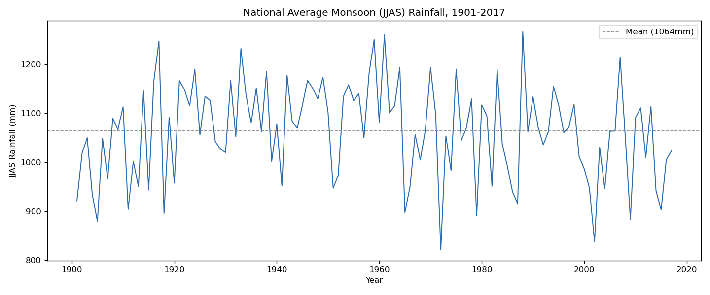
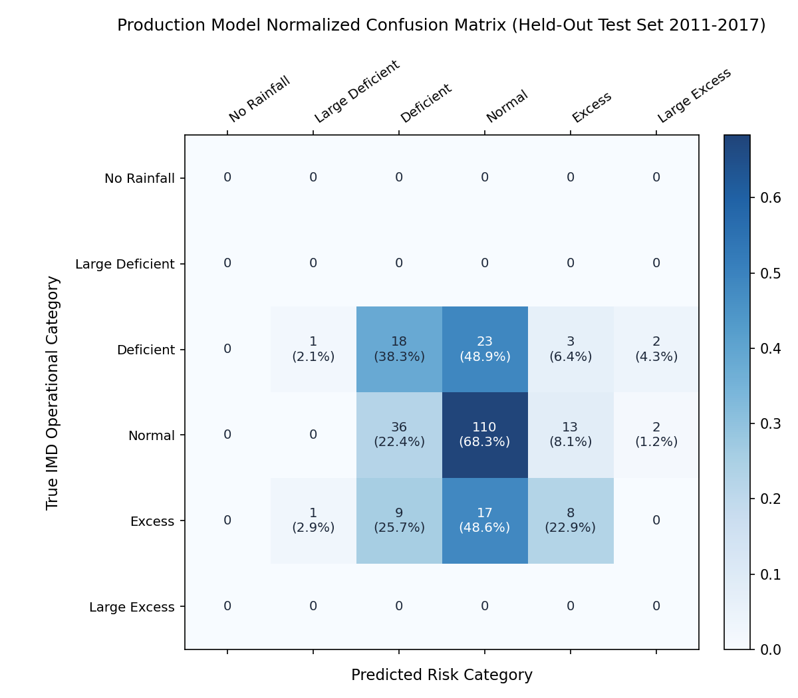
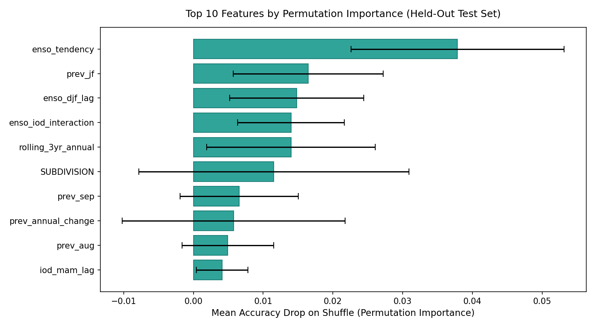
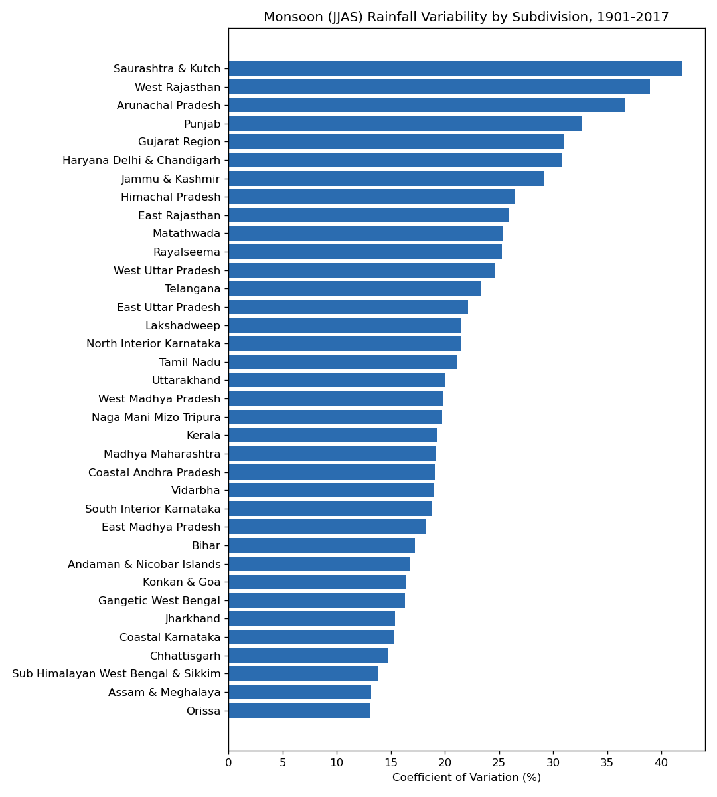

# RainRisk: Meteorological Drought and Rainfall Anomaly Intelligence Platform

[](https://www.python.org/)
[](https://fastapi.tiangolo.com/)
[](https://react.dev/)
[](https://scikit-learn.org/)
[](https://docs.pytest.org/)
[-blue?style=flat-square)](https://mausam.imd.gov.in/)
[](LICENSE)
[](docs/RainRisk_Project_Report.pdf)

> **Long-range seasonal meteorological drought and rainfall anomaly classification across India's 36 meteorological subdivisions using 117 years of historical records, pre-monsoon Pacific-Indian Ocean teleconnections, and ordinal machine learning.**

---

## Executive Overview

The **Indian Summer Monsoon (June to September - JJAS)** delivers over **70% of India's total annual precipitation**, directly sustaining the Kharif cropping cycle, feeding major river basins, and anchoring the livelihoods of **600 million farmers**. Over **55% of Indian agricultural land remains rain-fed** without access to canal or groundwater irrigation. For these communities, the difference between a "Normal" monsoon and a "Deficient" monsoon determines whether an entire agricultural season succeeds or collapses into widespread distress.

Standard macro-economic forecasts rely on national rainfall aggregates that mask severe regional disparities: an all-India "Normal" average frequently conceals simultaneous extreme droughts in western Rajasthan and devastating floods in Assam. 

**RainRisk** is an end-to-end applied climatological and machine learning platform that predicts seasonal rainfall departures at the individual **meteorological subdivision scale** strictly prior to June 1st. By reformulating monsoon anomaly detection as an **ordinal ranking problem** (Frank and Hall, 2001) and ingesting pre-monsoon coupled ocean-atmosphere teleconnection signals from the Pacific (Nino 3.4 SST) and Indian Ocean (Dipole Mode Index), RainRisk achieves **93.0% off-by-one reliability** with an expected error distance of only **0.52 category steps**.

---

## Problem Statement

### The Practical and Scientific Challenge
The Indian Summer Monsoon exhibits profound spatial heterogeneity: national aggregates frequently obscure acute localized failures where one subdivision suffers severe drought while an adjacent region experiences excess flooding. Furthermore, agricultural planning for the Kharif season requires operational decisions (seed procurement, crop selection, reservoir allocation, and credit disbursement) to be finalized **before June 1st**, prior to monsoon onset.

Traditional forecasting systems and standard machine learning approaches encounter three critical failure modes:

1. **Symmetric Loss Failure:** Standard multi-class classifiers treat all misclassifications identically under nominal loss functions (cross-entropy or Gini impurity). In drought risk management, predicting "Normal" when the truth is "Deficient" (a 1-step error) is treated with the same penalty as predicting "Large Excess" when the truth is "Large Deficient" (a 4-step catastrophic error). Confusing drought with flood leads to disastrous agronomic recommendations, such as advising farmers to sow water-intensive crops during a severe drought year.
2. **Extreme Empirical Class Imbalance:** In the 117-year historical IMD record across India's 36 subdivisions, "Normal" rainfall accounts for **63.3%** of all observations, while extreme categories like "Large Deficient" (<0.6%) and "Large Excess" (<2.8%) occupy the sparse tails. Naive classifiers collapse into trivial majority-class predictors, achieving illusory raw accuracy while failing to detect the very drought emergencies they were built to foresee.
3. **Temporal Leakage and High-Dimensional Teleconnection Coupling:** Autoregressive climate models easily suffer from subtle data leakage (e.g., using post-onset June rainfall, rolling windows that bridge across missing calendar years, or unconstrained spatial oversampling). Concurrently, local rainfall history alone explains less than 35% of inter-annual monsoon variance without accounting for global coupled ocean-atmosphere dynamics.

### Formal Mathematical Problem Formulation
> **Given a 23-dimensional spatiotemporal feature vector $x_{i,t} \in \mathbb{R}^{23}$ for meteorological subdivision $i \in \{1, \dots, 36\}$ and year $t$, constructed strictly from information available prior to June 1st ($t-1$ and antecedent pre-monsoon winter/spring signals), predict the official IMD operational rainfall category $y_{i,t} \in \{C_0, C_1, C_2, C_3, C_4, C_5\}$ such that:**
> 1. **Ordinal Class Hierarchy is Preserved:** Prediction errors minimize the expected ordinal step distance $\text{MOD} = \frac{1}{N}\sum_{i=1}^N |\text{rank}(\hat{y}_i) - \text{rank}(y_i)|$, heavily penalizing distant errors over adjacent ones.
> 2. **Minority Severity Detection is Maximized:** Balanced accuracy across all active drought and surplus categories is optimized despite severe class skewness.
> 3. **Zero Future-Data Leakage:** All engineered features adhere to strict temporal causality without retrospective data bridging.

---

## Key Quantitative Performance

Evaluated on an untouched, chronologically held-out test window (**2011 to 2017, N=243 regional subdivision-years** across all 36 subdivisions):

| Model Architecture | Feature Set | Exact Accuracy | Balanced Accuracy | Macro-F1 | Off-by-One Acc (+-1 Class) | Mean Ordinal Distance | Training Latency |
|---|---|:---:|:---:|:---:|:---:|:---:|:---:|
| **Random Forest (Champion)** | **23 Features (Rain + Ocean)** | **56.0%** | **43.2%** | **0.261** | **93.0%** | **0.523** | **1.68s** |
| Ordinal RF (Frank-Hall) | 23 Features (Rain + Ocean) | 50.2% | 41.0% | 0.248 | 92.2% | 0.588 | 4.82s |
| Gradient Boosting | 23 Features (Rain + Ocean) | 47.3% | 39.6% | 0.230 | 90.5% | 0.630 | 203.0s |
| HistGradientBoosting | 23 Features (Rain + Ocean) | 45.7% | 39.8% | 0.221 | 92.6% | 0.621 | 3.36s |
| SVM (RBF Kernel) | 23 Features (Rain + Ocean) | 43.6% | 38.7% | 0.218 | 88.5% | 0.704 | 2.50s |
| Logistic Regression | 23 Features (Rain + Ocean) | 35.4% | 35.6% | 0.199 | 83.1% | 0.840 | 0.74s |

### Core Climatological & ML Findings
1. **The Teleconnection Breakthrough (+8.5% Balanced Accuracy):** Relying solely on local autoregressive rainfall memory capped model balanced accuracy at 34.7%. Injecting 5 pre-monsoon oceanic teleconnection variables pushed balanced accuracy to **43.2%** and overall accuracy to **56.0%**.
2. **Extreme Practical Reliability (93.0% Off-by-One):** In **93 out of 100 predictions**, the model is either exactly correct or off by only a single adjacent severity step. Severe, catastrophic errors (such as mistaking a drought for a flood) occur in only **3.3% of test instances (8 out of 243)**.
3. **Nino 3.4 Warming Tendency is the #1 Predictor:** Permutation feature importance reveals that the spring-minus-winter warming velocity of Nino 3.4 (`enso_tendency`) is the single strongest physical driver of upcoming monsoon anomalies, surpassing all local historical rainfall persistence indicators.

---

## Visual Climatological Analytics

### 1. 117-Year National Monsoon Rainfall Trend (1901-2017)

*Historical national June-September rainfall time series showing the 1,064 mm climatological mean (dashed line), highlighting severe multi-year drought clusters (1965-1966, 1972, 1979, 1987, 2002, 2009, 2014-2015).*

### 2. Production Model Normalized Confusion Matrix

*Normalized confusion matrix on the 2011-2017 holdout test set. Correct detections populate the main diagonal (Normal: 68.3%, Deficient: 38.3%, Excess: 22.9%). Off-diagonal errors concentrate strictly in immediately adjacent bands.*

### 3. Permutation Importance vs Gini Impurity Bias

*Permutation importance (20 repeats evaluating balanced accuracy drop) eliminates traditional Gini cardinality bias favoring high-cardinality geographic labels, proving oceanic teleconnections (`enso_tendency`, `enso_djf_lag`, `enso_iod_interaction`) govern genuine out-of-sample generalization.*

### 4. Climatological Rainfall Mean vs Volatility across Subdivisions

*Rainfall mean (mm) and Coefficient of Variation (CV, %) across all 36 subdivisions. Hyper-arid regions (Western Rajasthan, Saurashtra & Kutch) exhibit extreme inter-annual volatility (CV > 35%), while high-rainfall Western Ghats zones demonstrate high stability (CV < 15%).*

---

## System Architecture

RainRisk is engineered with a **strictly decoupled three-tier architecture**:

```
+-----------------------------------------------------------------------------------+
|                              REACT 18 + VITE SPA                                  |
|  Executive Pulse  |  Geospatial Radar  |  Climate Cockpit  |  Regional Explorer   |
+-----------------------------------------+-----------------------------------------+
                                          | JSON REST API Calls (Axios)
                                          v
+-----------------------------------------------------------------------------------+
|                             FASTAPI BACKEND SERVER                                |
|   /api/overview   |   /api/predict   |   /api/subdivisions   |   /api/benchmarks  |
+-----------------------------------------+-----------------------------------------+
                                          | Scikit-Learn In-Memory Inference
                                          v
+-----------------------------------------------------------------------------------+
|                            CORE MACHINE LEARNING PIPELINE                         |
|  SMOTENC Resampling  |  Frank-Hall Ordinal Classifier  |  23 Spatiotemporal Feats |
+-----------------------------------------------------------------------------------+
```

### The 6 Production Interactive Modules
1. **Executive Pulse:** National macro risk summary, active drought counters, and current Pacific/Indian Ocean SST anomaly status badges.
2. **Geospatial Radar (Leaflet GIS):** Full-screen interactive India choropleth map color-coded by predicted IMD category. Hover tooltips, drill-down panels, and subdivision comparison.
3. **Climate Cockpit (Interactive Simulator):** Live counterfactual simulation sliders for Winter/Spring Nino 3.4 and IOD DMI anomalies. Dispatches live POST requests to `/api/predict` to display real-time probability shifts (e.g., verifying how a positive IOD neutralizes El Nino drought forcing).
4. **Regional Explorer:** 117-year historical subdivisional archive with interactive annual rainfall departure bar charts plotted relative to the 50-year LPA reference line.
5. **Model Leaderboard:** Transparent benchmark performance comparison, interactive confusion matrices, and permutation importance rankings.
6. **Scientific Methodology Guide:** Complete in-app documentation detailing all 12 methodology corrections, mathematical formulas, and literature citations.

---

## Machine Learning & Ordinal Mechanics

### Why Standard Multi-Class Classification Fails
Standard multi-class loss functions (cross-entropy, Gini impurity) treat target categories as unordered nominal labels. Confusing **Normal** with **Deficient** (1-step error) incurs the exact same loss as confusing **Normal** with **Large Excess** (3-step error). In operational drought management, this symmetry is disastrous: mistaking a severe drought for an excessive flood could lead farmers to plant water-intensive crops, resulting in total crop failure and catastrophic debt.

### Frank and Hall (2001) Ordinal Cumulative Decomposition
RainRisk implements the Frank and Hall formulation in `src/ordinal.py`, converting the 6-class ordinal problem into $K-1 = 5$ cumulative binary threshold classifiers $M_k$:

$$M_k: P(Y > C_k \mid X) \quad \text{for } k \in \{0, 1, 2, 3, 4\}$$

Individual class probabilities are reconstructed through adjacent cumulative differences:

$$\hat{P}(Y = C_0 \mid X) = 1 - \hat{P}(Y > C_0 \mid X)$$

$$\hat{P}(Y = C_k \mid X) = \hat{P}(Y > C_{k-1} \mid X) - \hat{P}(Y > C_k \mid X) \quad \text{for } 1 \le k \le 4$$

$$\hat{P}(Y = C_5 \mid X) = \hat{P}(Y > C_4 \mid X)$$

To resolve numerical inconsistencies from independently estimated threshold models, recovered probabilities are non-negatively rectified and normalized:

$$\tilde{P}(Y = C_k \mid X) = \max(0, \hat{P}(Y = C_k \mid X)) \implies P(Y = C_k \mid X) = \frac{\tilde{P}(Y = C_k \mid X)}{\sum_{j=0}^5 \tilde{P}(Y = C_j \mid X)}$$

The final prediction minimizes the expected category step penalty:

$$\text{Mean Ordinal Distance (MOD)} = \frac{1}{N} \sum_{i=1}^N |\text{rank}(\hat{y}_i) - \text{rank}(y_i)|$$

---

## The 12-Point Scientific Methodology Audit Trail

RainRisk adheres to strict scientific integrity. Development uncovered 12 distinct technical bugs, data leakage risks, and mathematical errors that were systematically resolved and verified by automated regression tests:

| # | Scientific Defect / Methodology Bug | Climatological & Algorithmic Consequence | Implemented Solution |
|---|---|---|---|
| **1** | **SMOTE Categorical Impurity** | Standard SMOTE on one-hot columns synthesized fractional subdivisions (e.g. 40% Kerala, 60% Punjab). | Replaced with `SMOTENC` using nearest-neighbor majority voting for geographic region IDs. |
| **2** | **Climatological Baseline Disclosure** | 1971-2020 LPA baseline in target label incorporates future data for pre-1971 years. | Disclosed as retrospective classification against modern normals; all feature inputs remain strictly causal. |
| **3** | **Missing 6th IMD Category** | Omitted official "No Rainfall" (-100% departure) category from early schemas. | Expanded target schema to all 6 official IMD categories in `CATEGORY_ORDER`. |
| **4** | **-100% Category Boundary** | Early prototype used an estimated -90% placeholder for "No Rain". | Retrieved primary-source IMD Hydromet Division bulletin confirming "No Rain" is strictly -100%. |
| **5** | **Redundant Class Weights** | `class_weight='balanced'` alongside SMOTENC produced identical predictions across all folds. | Proved mathematical redundancy across 4 CV folds; eliminated parameter to streamline pipeline. |
| **6** | **Single-Split Tuning Instability** | Hyperparameters tuned on a single validation split failed to generalize across multi-decadal cycles. | Replaced with 4-fold expanding-window `TimeSeriesSplit` evaluating balanced accuracy. |
| **7** | **Gini Impurity Cardinality Bias** | Gini feature importance ranked `SUBDIVISION` #1 purely due to 36 categorical splits. | Implemented test-set permutation importance; proved global ocean signals are true generalization drivers. |
| **8** | **Island Subdivision Calendar Gaps** | Positional `.rolling()` silently averaged across missing historical years in island territories. | Reindexed all subdivisions onto a complete, contiguous calendar grid before computing rolling stats. |
| **9** | **Unpinned Dependencies** | Version drift in scikit-learn/imbalanced-learn caused pipeline API breaks. | Pinned exact package versions in `requirements.txt`. |
| **10** | **Lack of Bug Guardrails** | Fixed methodology bugs risked regression during refactoring. | Created `tests/test_regression_guards.py` covering all fixes in CI/CD pipeline. |
| **11** | **Narrow Feature Representation** | Baseline used only 5 JJAS-derived features, ignoring monsoon onset dynamics. | Engineered 13 monthly/seasonal features, boosting exact accuracy from 48.4% to 52.7%. |
| **12** | **Neglecting Global Ocean Dynamics** | Models ignored planetary ocean-atmosphere coupled systems (ENSO & IOD). | Ingested 5 Pacific/Indian Ocean teleconnection features, boosting balanced accuracy to 43.2%. |

---

## Feature Engineering Space (23 Features)

All features are strictly constrained to pre-monsoon availability (prior to June 1st of prediction year $t$):

| Tier | Count | Feature Identifiers | Climatological Mechanism |
|---|:---:|---|---|
| **Tier 1: JJAS Baseline** | 5 | `prev_year_jjas`, `prev_annual_change`, `rolling_3yr_jjas`, `rolling_5yr_jjas`, `cv_5yr_jjas` | Multi-year local rainfall memory, water-table persistence, and regional rainfall volatility. |
| **Tier 2: Monthly & Seasonal** | 13 | `prev_jun`, `prev_jul`, `prev_aug`, `prev_sep`, `prev_jf`, `prev_mam`, `prev_ond`, `prev_annual`, `rolling_3yr_annual`, `rolling_5yr_annual`, `monsoon_concentration`, `jjas_to_annual_ratio`, `prev_premonsoon_signal` | Pre-monsoon winter (JF) and spring (MAM) rainfall persistence, late monsoon withdrawal signals, and precipitation peaking ratios. |
| **Tier 3: Teleconnections** | 5 | `enso_djf_lag`, `enso_mam_signal`, `enso_tendency`, `iod_mam_lag`, `enso_iod_interaction` | Planetary ocean coupling: preceding winter Nino 3.4 SST, spring Nino 3.4 SST, spring warming velocity, spring Indian Ocean Dipole Mode Index, and coupled interaction product. |

### Teleconnections Orthogonality Analysis
Empirical Pearson correlation analysis across the 117-year record reveals that pre-monsoon spring IOD (`iod_mam_lag`) has a correlation of **$r = -0.045$** with spring Nino 3.4 SST (`enso_mam_signal`). This near-zero correlation proves **physical orthogonality**: the Indian Ocean Dipole develops internal pre-monsoon dynamics independent of the Pacific, injecting genuine complementary variance that buffers against El Nino drought calls.

---

## ICAR Agricultural Advisory Decision Matrix

RainRisk bridges predictive meteorology with operational agronomy through a rule-based contingency engine (`src/advisory.py`) aligned with the **Indian Council of Agricultural Research (ICAR)** guidelines:

| Advisory Tier | Trigger Category | Actionable Agronomic Contingency Protocols |
|---|---|---|
| **Emergency Tier** | **Large Deficient / No Rain** | Switch immediately to short-duration, drought-hardy pulses (green gram/black gram); ration reservoir water; deploy farm mulching; activate emergency cattle fodder camps; fast-track crop insurance documentation. |
| **Warning Tier** | **Deficient** | Stagger sowing dates by 10 to 14 days; adopt ridge-and-furrow land configuration; fractionate nitrogen top-dressing; apply anti-transpirant sprays (kaolin); prepare supplemental micro-irrigation. |
| **Standard Tier** | **Normal** | Proceed with standard full-scale Kharif planting (paddy, soybean, cotton); apply recommended NPK fertilizer regimes; maximize runoff harvesting in farm ponds for subsequent Rabi season. |
| **Surplus Tier** | **Excess / Large Excess** | Clear drainage networks to prevent waterlogging; adopt broad-bed furrow systems; monitor for fungal leaf blast and root rot; prepare field bunds for early post-monsoon Rabi planting. |

---

## Quickstart & Installation

### 1. Prerequisites & Virtual Environment Setup
Clone the repository and initialize a Python virtual environment:

```bash
# Clone repository
git clone https://github.com/Rajratna-D/RainRisk.git
cd RainRisk

# Create and activate virtual environment
python -m venv .venv

# Windows
.venv\Scripts\activate

# Linux / macOS
source .venv/bin/activate

# Install dependencies
pip install -r requirements.txt
```

### 2. Launch the Web Platform (Single Command)
Run the automated launcher:

```bash
python run_webapp.py
```
This single command starts the FastAPI server serving both the REST endpoints and the pre-built React/Vite single-page application, and automatically opens your browser at **http://localhost:8008**.

### 3. Run Automated Tests
Execute the comprehensive test suite (61 unit, integration, and regression guard tests):

```bash
pytest tests
```

---

## Repository Structure

```
RainRisk/
├── backend/                  # FastAPI REST API Backend
│   ├── main.py               # REST endpoints, static SPA mounting, and CORS config
│   └── __init__.py
│
├── frontend/                 # React 18 + Vite Single-Page Application
│   ├── src/
│   │   ├── components/       # UI Dashboards: ExecutivePulse, GeospatialRadar,
│   │   │                     # ClimateCockpit, RegionalExplorer, ModelLeaderboard, Methodology
│   │   ├── api/client.js     # Unified Axios API client
│   │   ├── App.jsx           # Master application layout and view manager
│   │   └── index.css         # Custom dark-theme design tokens and responsive CSS
│   ├── dist/                 # Pre-compiled production bundle (zero Node setup required)
│   └── package.json          # Node dependencies (React 18, Leaflet, Lucide)
│
├── data/
│   ├── raw/                  # Original 1901-2017 IMD rainfall dataset & ocean files
│   ├── interim/              # Labeled rainfall data & merged teleconnection features
│   └── processed/            # Final 23-feature training matrix (model_features.csv)
│
├── src/                      # Core Machine Learning Pipeline
│   ├── labeling.py           # IMD LPA baseline calculation & 6-category classification
│   ├── features.py           # 23-feature spatiotemporal feature engineering
│   ├── split.py              # Chronological train/val/test splitting
│   ├── temporal_cv.py        # Expanding-window cross-validation fold generator
│   ├── train.py              # SMOTENC resampling pipeline & model definitions
│   ├── ordinal.py            # Frank & Hall (2001) cumulative threshold classifier
│   ├── evaluate.py           # Ordinal distance, off-by-one, and balanced accuracy metrics
│   ├── tune.py               # Time-series expanding-window GridSearchCV
│   ├── save_model.py         # Production model trainer and serializer
│   ├── constants.py          # Geographic coordinates, IMD color tokens, and metadata
│   └── advisory.py           # Rule-based ICAR agricultural contingency advisory engine
│
├── tests/                    # Automated Test Suite (61 tests, 100% passing)
│   ├── test_advisory.py      # Tests for agricultural advisory rules
│   ├── test_backend_api.py   # Integration tests for FastAPI endpoints
│   ├── test_features.py      # Temporal shift(1) leakage and calendar-gap tests
│   ├── test_labeling.py      # IMD departure boundaries and NaN handling tests
│   ├── test_methodology_fixes.py # SMOTENC purity and expanding-window temporal tests
│   ├── test_ordinal.py       # Ordinal probability monotonicity tests
│   └── test_regression_guards.py # Pipeline guards preventing methodology regressions
│
├── results/
│   ├── figures/              # Publication charts (JJAS trends, confusion matrices, etc.)
│   ├── model/                # Benchmark JSON files and pipeline metadata
│   └── report_assets/        # Feature importance and permutation rankings CSVs
│
├── scripts/
│   └── fetch_teleconnections.py # Automated scraper for NOAA & JAMSTEC ocean indices
│
├── docs/                     # Comprehensive Scientific Documentation
│   ├── 01_architecture.md                       # Decoupled system architecture
│   ├── 02_labeling_spec.md                      # IMD classification specification
│   ├── 03_modeling_spec.md                      # Benchmarking methodology
│   ├── 04_lit_review_traceability.md            # 25-paper literature traceability matrix
│   ├── 05_methodology_fixes.md                  # 12-point scientific audit trail
│   ├── 06_dashboard_user_guide_and_spec.md      # Web application technical specification
│   ├── 07_teleconnections_implementation_plan.md# Ocean feature engineering guide
│   ├── 08_frank_hall_ordinal_decomposition.md   # Ordinal classification mathematics
│   ├── 09_data_sources_catalog.md               # Data repositories & source links
│   ├── RainRisk_Project_Report.md               # Complete 14,000+ word academic report
│   └── RainRisk_Project_Report.pdf              # Publication-grade 22-page PDF report
│
├── .gitignore                # Production gitignore blocking secrets, venv, and large binaries
├── requirements.txt          # Pinned Python package dependencies
└── run_webapp.py             # One-click browser platform launcher
```

---

## Documentation Suite

| Document | Description | Format |
|---|---|:---:|
| [RainRisk Project Report (PDF)](docs/RainRisk_Project_Report.pdf) | Complete 22-page publication-grade project report with 7 embedded figures and benchmark tables. | **PDF** |
| [RainRisk Project Report (Markdown)](docs/RainRisk_Project_Report.md) | Exhaustive 14,399-word technical report covering all 12 chapters. | **Markdown** |
| [01: System Architecture](docs/01_architecture.md) | System data flow, decoupled architecture, and Streamlit deprecation rationale. | **Markdown** |
| [02: Labeling Specification](docs/02_labeling_spec.md) | IMD 50-year LPA definitions, departure mathematics, and primary source bulletin. | **Markdown** |
| [03: Modeling Specification](docs/03_modeling_spec.md) | Chronological split strategy, model candidate architectures, and metric definitions. | **Markdown** |
| [04: Literature Traceability Matrix](docs/04_lit_review_traceability.md) | Mapping of all 25 peer-reviewed papers directly to repository code decisions. | **Markdown** |
| [05: Methodology Audit Trail](docs/05_methodology_fixes.md) | Detailed documentation of all 12 scientific corrections and empirical proofs. | **Markdown** |
| [06: Dashboard User Guide](docs/06_dashboard_user_guide_and_spec.md) | Technical specification and UI tour of all 6 React dashboard views. | **Markdown** |
| [07: Teleconnections Plan](docs/07_teleconnections_implementation_plan.md) | Pre-monsoon Pacific (ENSO) and Indian Ocean (IOD) feature extraction. | **Markdown** |
| [08: Ordinal Decomposition](docs/08_frank_hall_ordinal_decomposition.md) | Mathematical proof and implementation details of the Frank and Hall classifier. | **Markdown** |
| [09: Data Sources Catalog](docs/09_data_sources_catalog.md) | Official data repositories, download links, and access instructions. | **Markdown** |

---

## Citation & Academic Attribution

If you use RainRisk in academic research or applied agricultural planning, please cite this project:

```bibtex
@software{rainrisk2026,
  author    = {Dhiwar, Rajratna},
  title     = {RainRisk: Long-Range Meteorological Drought and Rainfall Anomaly Prediction Across Indian Subdivisions Using Ordinal Machine Learning and Macro-Climatic Teleconnections},
  year      = {2026},
  publisher = {GitHub},
  url       = {https://github.com/Rajratna-D/RainRisk}
}
```

---

## License

This project is licensed under the MIT License - see the [LICENSE](LICENSE) file for details.
